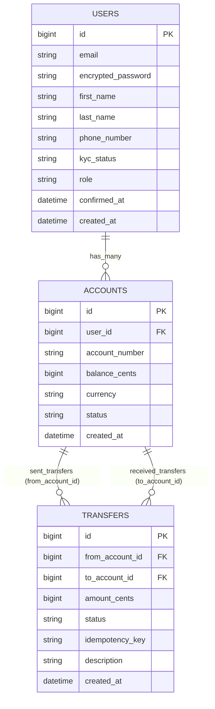
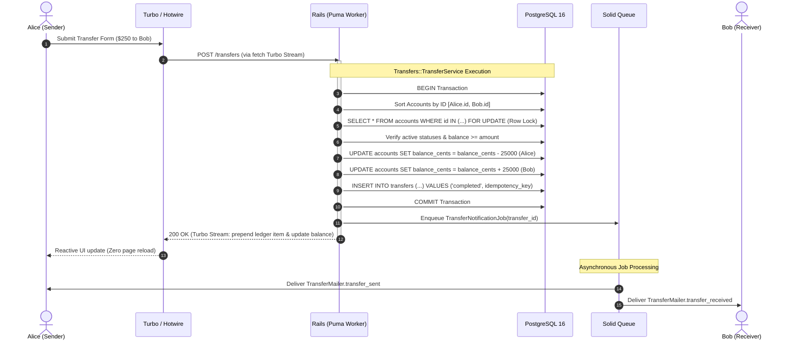

# FxBank &mdash; Digital Banking SaaS Platform

[](https://www.ruby-lang.org/)
[](https://rubyonrails.org/)
[](https://www.postgresql.org/)
[](https://hotwired.dev/)
[](https://tailwindcss.com/)
[](https://rspec.info/)
[](https://github.com/rails/solid_queue)
[](https://kamal-deploy.org/)
[](https://www.docker.com/)

> **Official reference repository** for **Course 1: Building a Modern SaaS Banking Application** at [Ruby on Rails Academy (rubyonrails.academy)](https://www.rubyonrails.academy).

**FxBank** is a production-grade digital banking SaaS platform engineered from first principles with Ruby on Rails. It demonstrates double-entry accounting ledgers, pessimistic concurrency locking, atomic money movements, Hotwire Turbo real-time dashboards, direct-to-cloud Active Storage uploads, Solid Queue background workers, and containerized zero-downtime deployments with Kamal 2.

---

## 🧭 Course Navigation: Branches & Checkpoint Folders

This repository is structured so you can explore the codebase either **by switching Git branches/tags** or **by browsing checkpoint folders** directly here on `main`:

| Section | Focus | Git Branch | Git Tag | Checkpoint Guide |
|---|---|---|---|---|
| **01** | Architecture, Tooling & Environment | [`section/01-foundations-architecture`](https://github.com/academyror/fxbank/tree/section/01-foundations-architecture) | `v0.1-section-1` | [Section 01 Guide](docs/checkpoints/01_foundations_architecture.md) |
| **02** | Domain Modeling & Database Craft | [`section/02-domain-modeling-database`](https://github.com/academyror/fxbank/tree/section/02-domain-modeling-database) | `v0.2-section-2` | [Section 02 Guide](docs/checkpoints/02_domain_modeling_database.md) |
| **03** | Authentication, Authorization & Roles | [`section/03-authentication-authorization`](https://github.com/academyror/fxbank/tree/section/03-authentication-authorization) | `v0.3-section-3` | [Section 03 Guide](docs/checkpoints/03_authentication_authorization.md) |
| **04** | Hotwire Frontend (Turbo & Stimulus) | [`section/04-hotwire-frontend-turbo-stimulus`](https://github.com/academyror/fxbank/tree/section/04-hotwire-frontend-turbo-stimulus) | `v0.4-section-4` | [Section 04 Guide](docs/checkpoints/04_hotwire_frontend_turbo_stimulus.md) |
| **05** | Media Storage, Workers & Email | [`section/05-cloud-media-background-jobs-email`](https://github.com/academyror/fxbank/tree/section/05-cloud-media-background-jobs-email) | `v0.5-section-5` | [Section 05 Guide](docs/checkpoints/05_cloud_media_background_jobs_email.md) |
| **06** | Testing & Quality Gates (RSpec TDD) | [`section/06-automated-testing-rspec-tdd`](https://github.com/academyror/fxbank/tree/section/06-automated-testing-rspec-tdd) | `v0.6-section-6` | [Section 06 Guide](docs/checkpoints/06_automated_testing_rspec_tdd.md) |
| **07** | Zero-Downtime Ops (Kamal 2 & Docker) | [`section/07-deployment-monitoring-day2-ops`](https://github.com/academyror/fxbank/tree/section/07-deployment-monitoring-day2-ops) | `v0.7-section-7` | [Section 07 Guide](docs/checkpoints/07_deployment_monitoring_day2_ops.md) |
| **Complete** | Production-Ready Master Stack | [`main`](https://github.com/academyror/fxbank/tree/main) | `Latest` | [Overview](#-architecture-overview) |

---

## 🏛️ Architecture Overview

### Relational Domain Model (ERD)



### Money Transfer Execution Sequence



---

## 🚀 Quick Start (Local Setup)

### Option A: Native Development

#### 1. Prerequisites
- Ruby 3.3.0+ (or 3.2+) (via `rbenv`, `rvm`, or `asdf`)
- PostgreSQL 16+ running locally
- Node.js 18+ and Yarn

#### 2. Install & Boot
```bash
# Clone the repository
git clone git@github.com:academyror/fxbank.git
cd fxbank

# Install gems and npm dependencies
bundle install
yarn install

# Prepare database and seed demo data
bin/rails db:prepare db:seed

# Start development servers (Rails server + Tailwind watch + esbuild watch)
bin/dev
```

Visit `http://localhost:3000` in your browser.

---

### Option B: Docker Compose (All-in-One)

You can run FxBank without installing Ruby, PostgreSQL, or Node on your machine:

```bash
# Build and boot all containers (Postgres 16, Puma, Solid Queue)
docker compose up --build

# In a separate terminal, prepare database and seed demo users:
docker compose exec web bin/rails db:prepare db:seed

# Access the application
open http://localhost:3000
```

---

## 🔐 Demo Credentials

When you run `bin/rails db:seed`, the following accounts are created:

| User | Email | Password | Role | KYC Status | Checking Balance |
|---|---|---|---|---|---|
| **Eleanor Vance** | `admin@fxbank.io` | `Password123!` | `admin` | Verified | &mdash; |
| **Alice Smith** | `alice@fxbank.io` | `Password123!` | `customer` | Verified | **$2,450.00 USD** |
| **Bob Jones** | `bob@fxbank.io` | `Password123!` | `customer` | Verified | **$750.00 USD** |
| **Charlie Vance** | `charlie@fxbank.io` | `Password123!` | `customer` | Pending | **$100.00 USD** |

---

## 🧪 Running Automated Tests

FxBank maintains a comprehensive financial testing suite using **RSpec**, **FactoryBot**, and **Shoulda Matchers**:

```bash
# Run the complete test suite
bundle exec rspec

# Run isolated transfer concurrency and atomic rollback specs
bundle exec rspec spec/services/transfers/transfer_service_spec.rb

# Run Pundit policy permission specs
bundle exec rspec spec/policies/

# Run HTTP request and Turbo Stream specs
bundle exec rspec spec/requests/
```

---

## 🚢 Deploying to Production (Kamal 2)

```bash
# 1. Configure production server IPs in config/deploy.yml
# 2. Setup servers and install Docker/Traefik
kamal setup

# 3. Deploy zero-downtime releases
kamal deploy
```

---

## 🎓 About Ruby on Rails Academy

This reference application is taught step-by-step in **Course 1: Building a Modern SaaS Banking Application** at [Ruby on Rails Academy](https://www.rubyonrails.academy).

- **Website:** [https://www.rubyonrails.academy](https://www.rubyonrails.academy)
- **Organization:** [github.com/academyror](https://github.com/academyror)
- **Course Focus:** High-concurrency financial SaaS engineering, Hotwire reactive UI, cloud media pipelines, TDD, and production DevOps.

---

## 📄 License

Open source under the [MIT License](LICENSE).
