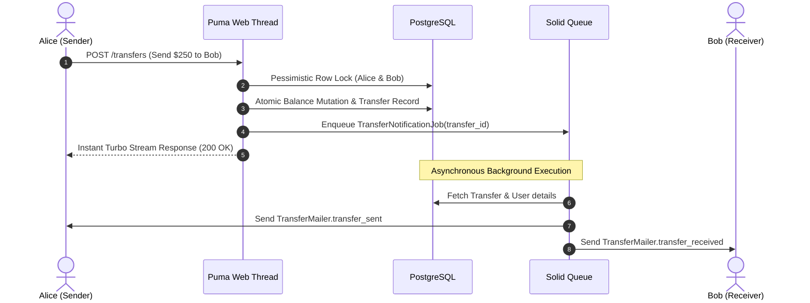

# FxBank &mdash; Section 5: Media Storage, Background Workers & Transactional Email

Welcome to **FxBank**, a production-grade digital banking SaaS platform built with Ruby on Rails 7.2+, PostgreSQL, Tailwind CSS, and Hotwire.

This repository accompanies **Course 1: Building a Modern SaaS Banking Application** at [Ruby on Rails Academy (rubyonrails.academy)](https://www.rubyonrails.academy).

---

## 📌 Section 5 Overview

In Section 5, we decouple heavy computational workloads, binary file streaming, and network latency from synchronous Puma web threads:
- **Active Storage**:
  - Direct-to-cloud uploads for KYC identity documents (passports, national IDs) and user avatars.
  - Eliminated Puma web thread starvation by bypassing Ruby application workers during multi-megabyte binary streaming.
  - Form validation on MIME content types and maximum file size limits (5MB avatar, 15MB KYC PDF/images).
- **Solid Queue**:
  - Database-backed Active Job queuing engine without Redis dependency.
  - Configured worker and dispatcher topologies in `config/queue.yml`.
  - Background workers:
    - `TransferNotificationJob`: asynchronous email dispatching to avoid SMTP latency spikes during transactions.
    - `KycVerificationJob`: asynchronous compliance document pipeline.
- **Action Mailer**:
  - `TransferMailer`: Branded transactional email templates (`transfer_sent` and `transfer_received`) in HTML and plain-text.

---

## 📬 Transaction Notification Flow

---

## 📚 Full Course & Interactive Curriculum

To access the complete step-by-step video lessons, quizzes, and community mentorship:  
👉 **[https://www.rubyonrails.academy](https://www.rubyonrails.academy)**
