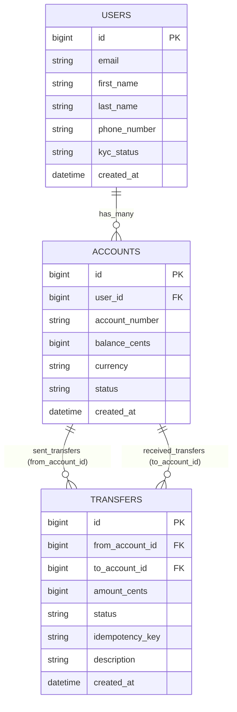

# FxBank &mdash; Section 2: Domain Modeling & Database Craft

Welcome to **FxBank**, a production-grade digital banking SaaS platform built with Ruby on Rails 7.2+, PostgreSQL, Tailwind CSS, and Hotwire.

This repository accompanies **Course 1: Building a Modern SaaS Banking Application** at [Ruby on Rails Academy (rubyonrails.academy)](https://www.rubyonrails.academy).

---

## 📌 Section 2 Overview

In Section 2, we translate high-level financial rules into durable database schemas and atomic money movements:
- Separated customer identity (`User`) from financial holdings (`Account`) and bilateral transfer ledgers (`Transfer`).
- Enforced PostgreSQL database-level check constraints: `balance_cents >= 0` and `amount_cents > 0`.
- Built `Transfers::TransferService` with pessimistic row locking (`lock!`) using deterministic primary key ID sorting to eliminate race conditions and deadlocks.
- Designed idempotency deduplication with unique UUID indexes to prevent duplicate debits from network retries.
- Seeded realistic banking fixtures in `db/seeds.rb`.

---

## 🗄️ Relational Domain Architecture



---

## 💻 Interactive Concurrency Verification Drill

You can test race-condition protection directly in `bin/rails console` using concurrent Ruby threads:

```ruby
# Start console
bin/rails c

# Fetch accounts
alice = Account.first
bob = Account.second

# Spawn two concurrent threads attempting to spend Alice's balance simultaneously:
t1 = Thread.new do
  Transfers::TransferService.call(from_account: alice, to_account: bob, amount_cents: alice.balance_cents)
rescue Transfers::TransferError => e
  puts "Thread 1 error: #{e.message}"
end

t2 = Thread.new do
  Transfers::TransferService.call(from_account: alice, to_account: bob, amount_cents: alice.balance_cents)
rescue Transfers::TransferError => e
  puts "Thread 2 error: #{e.message}"
end

[t1, t2].each(&:join)
# One thread succeeds; the other safely raises Transfers::InsufficientFundsError with zero balance drift!
```

---

## 📚 Full Course & Interactive Curriculum

To access the complete step-by-step video lessons and community mentorship:  
👉 **[https://www.rubyonrails.academy](https://www.rubyonrails.academy)**
